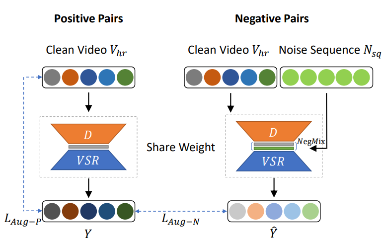
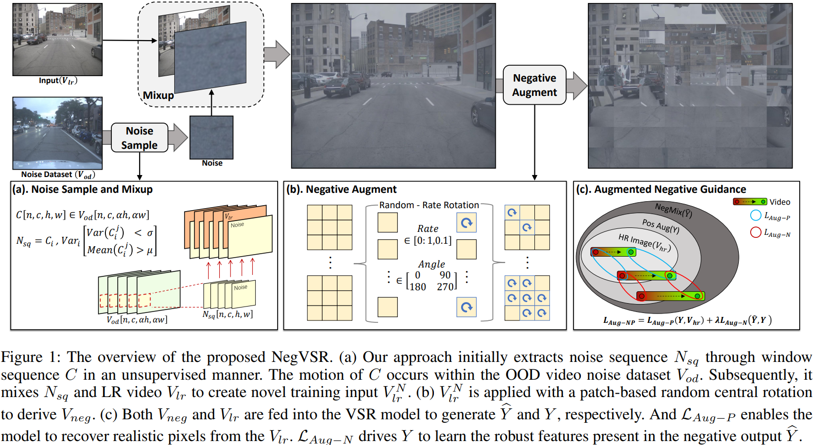
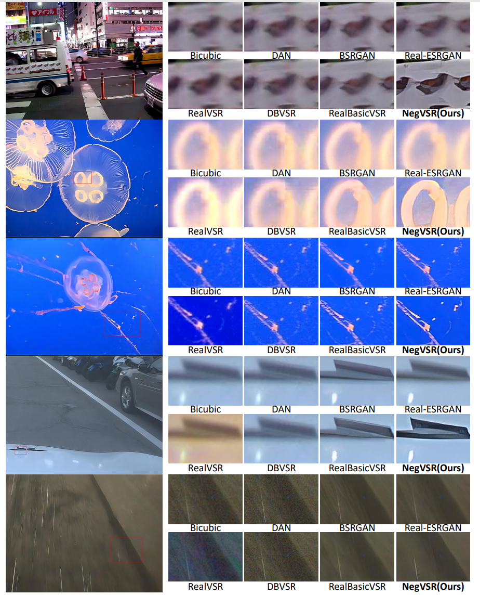

# NegVSR (AAAI 2024)

### NegVSR: Augmenting Negatives for Generalized Noise Modeling in Real-world Video Super-Resolution

> [](https://arxiv.org/abs/2305.14669)<br>

## Contents
- [Introduction](#introduction)
  - [Overview](#overview)
  - [Visual](#visual)
- [Dependencies and Installation](#dependencies-and-installation)
- [Quick Inference](#quick-inference)
- [Codes Demos](#codes-demos)
- [Image Quality Assessment](#image-quality-assessment)
- [Inference Dataset](#inference-dataset)
- [Citation](#citation)
- [Acknowledgement](#acknowledgement)

https://github.com/NegVSR/NegVSR/assets/132546798/3dbcf4aa-43c8-4357-b0fb-cc9a1f232a7f

## Introduction

We propose a Negatives augmentation strategy for generalized noise modeling in Video Super-Resolution (NegVSR) task. Specifically, we first propose sequential noise generation toward real-world data to extract practical noise sequences. Then, the degeneration domain is widely expanded by negative augmentation to build up various yet challenging real-world noise sets. We further propose the augmented negative guidance loss to learn robust features among augmented negatives effectively. Extensive experiments on real-world datasets (e.g., VideoLQ and FLIR) show that our method outperforms state-of-the-art methods with clear margins.



### Overview


### Visual



## Dependencies and Installation
- Following [RealBasicVSR](https://github.com/ckkelvinchan/RealBasicVSR)
- Python == 3.8
- Recommend mmedit version == 0.15.1

### Installation

1. Clone repo

    ```bash
    git clone https://github.com/NegVSR/NegVSR.git
    cd NegVSR
    ```
    
2. Install

    Following [RealBasicVSR](https://github.com/ckkelvinchan/RealBasicVSR)

## Quick Inference

Download the pre-trained NegVSR models [[Baidu Drive](https://pan.baidu.com/s/1cb-l62cusv8anPwvtfvR7Q )] (code:1234), and put them into the [weights](weights/) folder. Currently, the available pre-trained models are:

- `pretrain_wNegVSR_100000itr_finetune_woNegVSR_150000itr_VideoLQ.pth`: The sharper model for VideoLQ (Table 2).
- `pretrain_wNegVSR_100000itr_finetune_woNegVSR_150000itr_FLIR.pth`: The sharper model for FLIR (Table 3).
- `pretrain_wNegVSR_100000itr_finetune_wNegVSR_150000itr.pth`: Both pretrain and finetune use our method (Better visualization).

**Inference on Frames**

Replace the basicvsr_net.py in mmedit ('[Your anaconda root]/envs/[Your envs name]/lib/python3.x/site-packages/mmedit/models/backbones/sr_backbones'/basicvsr_net.py) with the  [basicvsr_net.py](codes/basicvsr_net.py) in our repository.

```bash
python codes/inference_realbasicvsr2.py
```
```console
Usage:
  --config              The test config file path. Default: 'configs/realbasicvsr_x4.py'
  --checkpoint          The pre-trained or customly trained model path. Default: 'weights/xxx.pth' 
  --input_dir	       	The directory of the input video. Default: 'VideoLQ'
                          VideoLQ:
                            000:
                              00000000.png
                              00000001.png
                              ...
                              00000099.png
                            001:
                            002:
  --output_dir        	Output root.
  --max_seq_len         The maximum sequence length to be processed. Default: 30
  --is_save_as_png      Whether to save as png. Default: True
  --fps                 The fps of the (possible) saved videos. Default: 25
```
After run the above command, you will get the SR frames.

**Image to Video**

We provide code for image to video conversion.

```bash
python codes/img2video.py
```
```console
Usage:
  --inputPath           The output root of 'inference_realbasicvsr2.py'
                          VideoLQ:
                            000:
                              00000000.png
                              00000001.png
                              ...
                              00000099.png
                            001:
                            002:
  --savePath            The output video root
                          savePath:
                            000.mp4
                            001.mp4
                            ...
  --fps                 The fps of the (possible) saved videos. 
```
We also provide code for video to image conversion. You can find in [video2img.py](codes/video2img.py)

## Codes Demos

**Collect noiseSequence**

```bash
# Run collect_noise_sequence_supplement.py directly
python codes/collect_noise_sequence/collect_noise_sequence_supplement.py
```

**Negative augmentation**

```bash
# Run rot_p.py directly
python codes/rot_PM/rot_p.py
```

We have migrated the negative augmentation code to [basicvsr_net.py](codes/basicvsr_net.py).

## **Image Quality Assessment**

**Selecting samples for evaluation**

```bash
# For FLIR
python codes/flir_sub.py
# For VideoLQ
python codes/videolq_sub.py 
```

**No-reference metrics calculation**

Recommended for using [IQA-PyTorch](https://github.com/chaofengc/IQA-PyTorch). Our paper results can be found in [Results](/results).

## Inference Dataset
1. You can download the VideoLQ and our FLIR testing dataset from [[Baidu Drive](https://pan.baidu.com/s/1cb-l62cusv8anPwvtfvR7Q )] (code:1234).
2. Click on the [FLIR](https://www.flir.com/oem/adas/adas-dataset-form) for the full FLIR dataset.

##  Citation
If you find this project useful for your research, please consider citing our paper. :smiley:
```bibtex
@article{song2023negvsr,
  title={NegVSR: Augmenting Negatives for Generalized Noise Modeling in Real-World Video Super-Resolution},
  author={Song, Yexing and Wang, Meilin and Xian, Xiaoyu and Yang, Zhijing and Fan, Yuming and Shi, Yukai},
  journal={arXiv preprint arXiv:2305.14669},
  year={2023}
}
```
## Acknowledgement
This project is build based on [RealBasicVSR](https://github.com/ckkelvinchan/RealBasicVSR) and [VQD-SR](https://github.com/researchmm/VQD-SR). We thank the authors for sharing their code.

